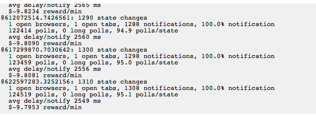
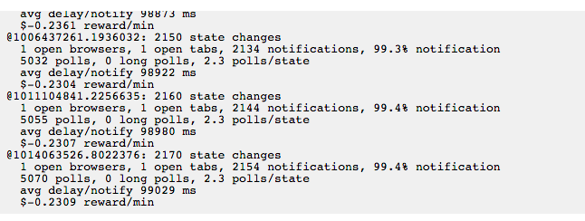
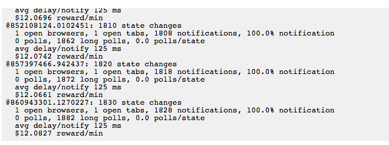
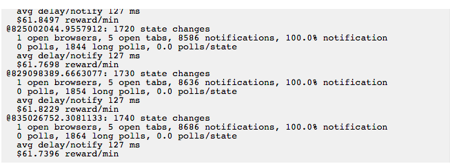
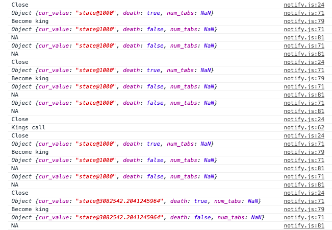
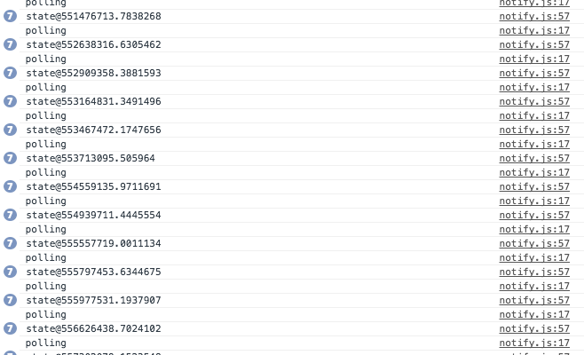
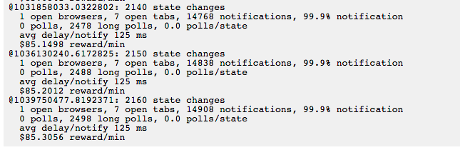
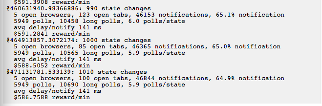

# The Long Poll 

I construct a robust algorithm for web client notification. I am building a web site that supports, say, a chat feature. In the Web architecture, it’s pretty easy to send live chat messages. When the user clicks a send button, Javascript packages up the chat message into a request and sends it to a server; the server records the message in a database. This fits naturally into the Web because the client’s in charge: the client makes an active request to the server. But receiving chat messages fits much less naturally. In the Web architecture, servers can’t contact clients to inform them of new chats! Every message exchange is initiated by a client.

Several Web technologies and techniques try to address this limitation; see [push technology](http://en.wikipedia.org/wiki/Push_technology). We’ll focus on two techniques, polling and long polling.

In the polling approach, the client makes frequent requests to check for updates. For instance, our client might check every 5 seconds for newly received chats. Polling fits cleanly into the Web architecture and is easy to write. Unfortunately, it uses a lot of resources, and it doesn’t provide instantaneous notification—an expected 2.5-second delay per chat is a long time!

Long polling is a version of polling that addresses some of its problems. In long polling, the client again requests the server to check for updates, but the server does not respond until an update actually occurs. That means the user gets near-instantaneous notification, and the server only gets one request per notification, rather than one request every 5 seconds.

Abstractly, long polling seems pretty close to perfect for notification! The problems with the approach only show up once you dig into its implementation.

Resources. On the server, a long-polling request corresponds to an open HTTP connection, which occupies resources. First, there’s the file descriptor for the connection. Operating systems enforce multiple limits on file descriptors: there’s a global limit on the number of file descriptors (on a current EC2 Linux machine, this is large—378,358), and a local limit on the number of file descriptors per process (on a current EC2 machine, this is small—1024—though it can be raised). Thus, a server might be able to handle many thousands of short-polling requests per second (because each request’s file descriptor is quickly closed, the limits are never reached), but 1024 concurrent long-polling requests could shut it down completely. Depending on the server technology, each long-polling request might also reserve a server process and a lot of server memory.

Timeouts. Networked programs must handle runaway requests: clients can silently die, server processes can enter infinite loops and never return, the network can crash, and so forth. It’s important for robustness that all runaway requests be shut down eventually; otherwise, a single programming error in a server process could take up resources forever, and a silent failure could be mistaken for success. Timeouts are the typical solution—if a request has run too long (say, for 5 minutes), the client and/or server will treat it as failed and shut it down. There are usually many timeouts simultaneously in play: the user’s browser can time out; the user’s networking equipment can time out; the server can time out on the client (Apache, NGINX) or on the process it runs to generate a response (Apache, NGINX); and the process can time itself out (for instance, the PHP interpreter has a time limit after which it suicides). Timeouts work transparently when successful requests are instantaneous—but long polling violates this assumption. It is easy for one or more system timeouts to cancel a long-polling request mistakenly, so we should set long-polling request timeouts to large values. But large timeouts don’t catch problems very well! A failed long-polling request can be mistaken for a successful one that just hasn’t returned yet.

Because of these issues, a robust, resilient client notification system must rely on a combination of polling and long-polling techniques, and ideally use other techniques too.

I have worked with testing architecture, `harness.js` in order to build this client. My most recent version is called `notify.js`. 

## Versions 

#### v0

To begin, I simply wanted to experiment with the most basic of configurations with one tab. The most basic of course being the version that was sent out along with the harness. This version simply called `make_poll` every 5000 milliseconds and notified the response it received from the server. The reward and stats looked as follows: 



The simplest thing that you would change here would be the intervals at which you poll the server and possibly the timeout (however I did not run the harness long enough to consider failure). It turns out that you could actually increase the interval of notification timers to 200,000 while still maintaining near perfect notification awareness and increasing your reward per min to an almost non-zero amount. However, if you notice below, the average delay/notification is nearly 100 seconds. 



#### v1

Another easy experiment would be to move to a completely long polling architecture. There are plenty of reasons not to do it, but let's try. I first began my implementation with an interval call to `make_long_poll`. This gave me a performance of -13 reward/min. Pretty bad. But to put a long poll on an interval does not make much sense. The long poll will take time to return. So you either need to send the server multiple long polls or need to give it a very wide interval. Both seem inefficient. 

Perhaps a better way to long poll is to always keep one long poll running at all times. (Note that again this will probably not be so good for multiple tabs open at once). This in truth is not the worst solution ever. In fact it is pretty decent. This will mean near instantaneous notifications (as you will see this empirically). It will deal with server crashes in not the worst way possible, it will simply throw long polls at them (could be better right, but pretty reliable client side). And as you will see, it will dramatically reduce the number of total polls, and increase our reward. See below:



Notice that the notification delay is almost a tenth of a millisecond. The number of polls nearly equals the number of state changes (though this is not shown in the polls per state). We get 100% notification. And we get a super positive reward ($12 moneys). This is all accomplished with a simple function: 

```javascript 

function rec_make_long_poll (timeout, cur_value) {
    function okay (ok,value) {
        if (ok && value != cur_value) {
                notify(value);
                cur_value = value;
        }
        make_long_poll(okay, timeout, cur_value);
    }
    make_long_poll(okay, timeout, cur_value);
}

```

#### v2

Now What is the problem with this? Okay there are perhaps three big problems. Number (1) is the most important. It is that this will crash and burn if there are multiple browsers. Specifically stated in the spec, if there are over 1024 browsers open, then this will crash the server. Long polls take up memory on the server, and even though they are really cool and make me moneys, I need to deal with that first. Second (2) is that there is possibly low reliability. I set the long polling timeout to a large value (ten minutes), but the large timeout will not catch the problems very well. A failed long-polling request can be mistaken for a successful one that just hasn’t returned yet.. Therefore to better ensure robustness, I should use a combination of long and short polls. And the third problem (3) is dealing with server crashes effectively. That means if a server crashes, I don't want to bombard the system. 

In **v2** I want to address the first concern. 

My first solution to this problem was very simple and made one crucial assumption: you never close browsers. In this model I am again using the only long polling method. I assign the first browser opened to be king. I keep track of the king using local storage. The king is the only one that long polls, and once a long poll is successful, the king will notify all of the other browsers through local storage. My code is very clean and elegant up to this point so I have saved a distinct version of this under `notify_v2.0.js`. The stats on this are also quite high (note that the monetary value can go as high as one really wants here, just add more browsers).



The second solution is far more complex unfortunately. And while it allows for the opening and closing of browsers, it introduces more problems as well. My second solution again uses browser storage in order to facilitate communication between tabs. There are two cases I cover. The first case is when all browser tabs become closed and a new tab is started up. I want to ensure that tab is king. The second situation is when the king tab is killed. Because tab identity (tab ids) is not available to us (and because the close tab function does not have access to the local vars that open tab has), I use a bit of randomization to decide on the new king. If a non-king tab has died, then the king will immediately respond. If the king has died, then each other tab will wait a random (distributed exponentially) amount of time. And the first tab to respond will be king. As you can guess, there are concurrency issues that could arise. These could easily be handled with a lock on browser memory, however I did not implement that yet (and with time constraints will doubtfully do so). 

To see how this worked, I logged a few events. First is when a tab is closed, it will log "Closed". Second is when the king responds, he will say "Kings Call". Third is when another tab claims the king title, he will say "Become King". And the final log is when a tab does nothing, he will say "NA". So check it out:



Notice some cool stuff (note that I have not implemented functionality for num_tabs, that comes next time). First is that when there is a close, and the king is still alive, he will simply do a kings call and then the other tabs do not need to respond. On the other hand, if the king is dead, then the first tab to respond becomes king and each other tab then does nothing. Pretty swank huh. There are concurrency issues, but in practice there does not seem to be many. Check out the below. I logged the number of polls per notifications below. And (you cannot see it here), but for the most part there was only one long poll per notification: 



I saved a copy of this version as `notifyv2.1.js`. The stats were good. There was almost a one to one ratio between polls and states. There was a close to perfect notification ratio. The average delay was less than 125 ms:



#### v3

Version three incorporates crashes. Unfortunately there is not solid architecture in the harness to completely deal with crashes, so I will build a bit of it out. The architecture that I will build will say that each poll crashes with a fixed percent chance. To do this I added a bit of code in the harness (a single line calling a crash function that I put in notify). Once done, I sought to deal with them. 

I still wanted to base my infrastructure on long polling. I wanted to maintain my near one to one ratio of long polls to state, and also my less than 150 ms response time. However, I knew that the long poll server would crash. To respond against this, I caused the client to resort to polling when the long server crashed. That is unfortunately as far as I got. 

This unfortunately glosses over much of the nuance. The long polling for me never failed silently, nor took obscenely long times to respond. If it did, I would want to rely more on the polling infrastructure. The polling never crashed, if it did I would want to stop pinging the server for periods of time to let it recover. The stats are below: 



## Themes 

Some themes that I encountered were: randomness, timeouts and duplication. I saw the great use of randomness and timeouts in my Kings Call model. Without randomness I could not have reliably assigned a new king, and without timeouts I could not ensure the current king could be heard. Timeouts also helped a great deal when it came to dealing with crashes and optimizing poll calls. The final theme that I saw was duplication. The long poll and the short poll were just two different ways of doing the same thing. By having duplicate functionality, I could make a more reliable system. 


